# User Flow Diagram - Moduláris WebApp MVP

**Verzió:** 1.0
**Utolsó frissítés:** 2025-09-29
**Készítette:** UX/UI Designer

---

## 📋 Áttekintés

Ez a dokumentum tartalmazza a főbb user flow-kat Mermaid diagram formátumban.

---

## 🔐 1. Regisztráció és Email Confirmation Flow

```mermaid
graph TD
    A[User Landing Page] --> B[Regisztráció Oldal]
    B --> C{Form Kitöltése}
    C -->|Valid| D[Email Confirmation Küldése]
    C -->|Invalid| B
    D --> E[Várj Email-re]
    E --> F[Email Érkezik]
    F --> G[Kattintás Confirmation Link-re]
    G --> H[/auth/callback]
    H --> I{Email Megerősítve}
    I -->|Success| J[Redirect Login Page]
    I -->|Error| K[Error Message]
    J --> L[Bejelentkezés]
```

---

## 🔑 2. Login Flow

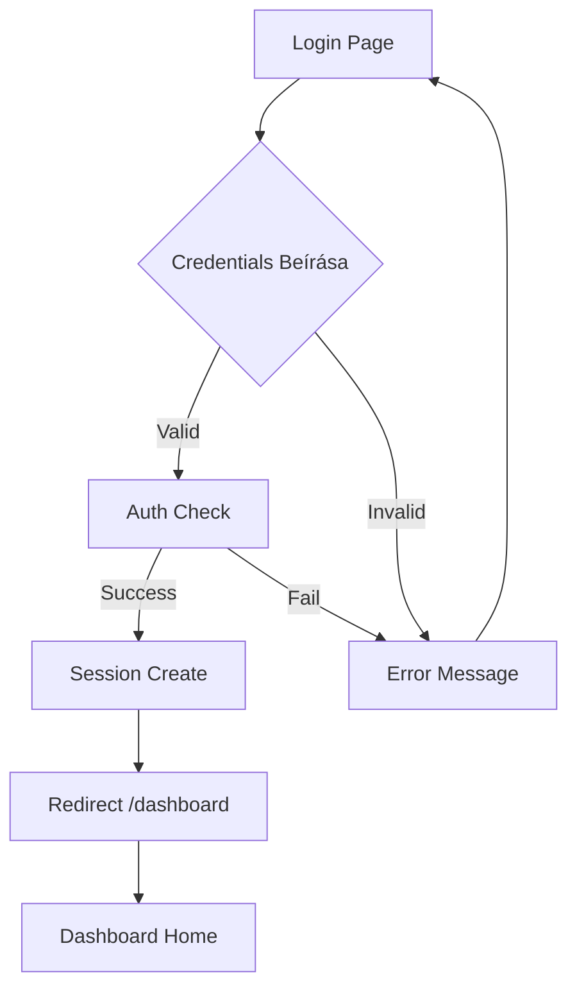

---

## 📊 3. Dashboard Navigation Flow

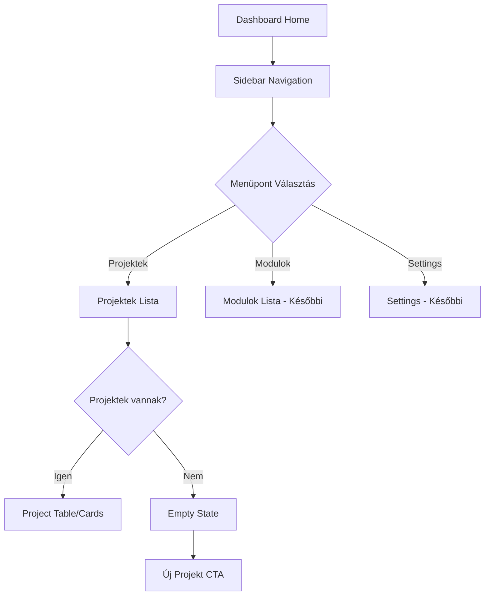

---

## ➕ 4. Projekt Létrehozás Flow

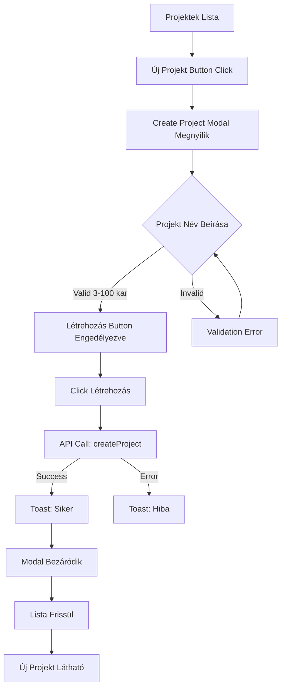

---

## ✏️ 5. Projekt Szerkesztés Flow

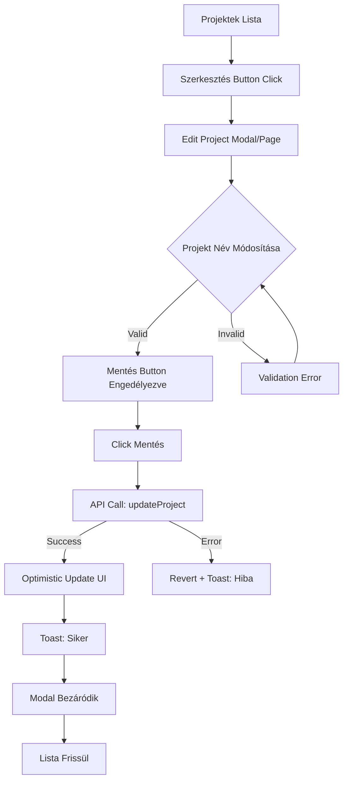

---

## 🗑️ 6. Projekt Törlés Flow

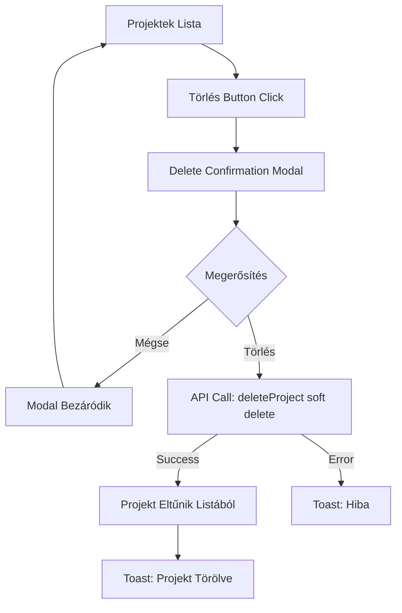

---

## 👤 7. Admin vs User vs Viewer Flow Különbségek

### Admin Flow
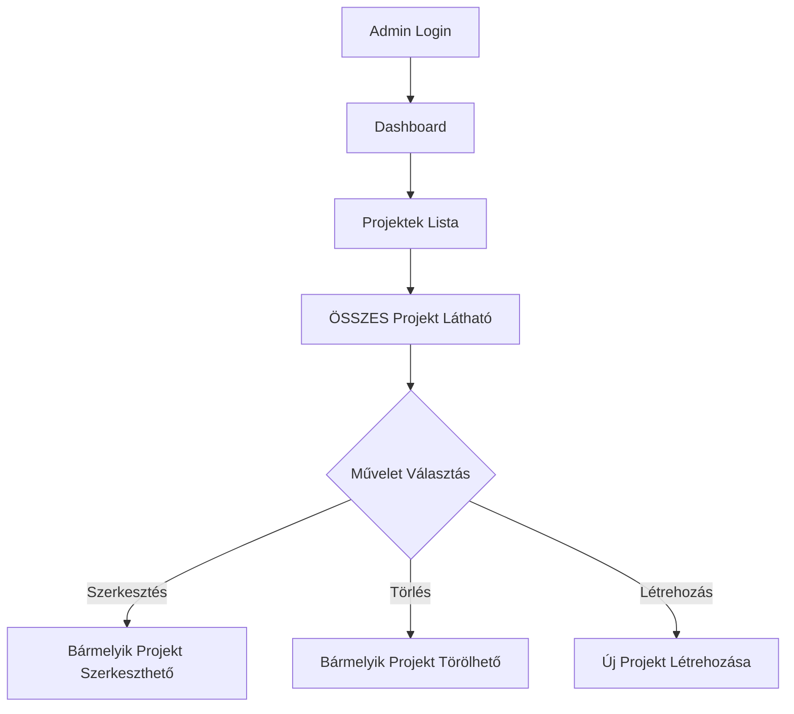

### User Flow
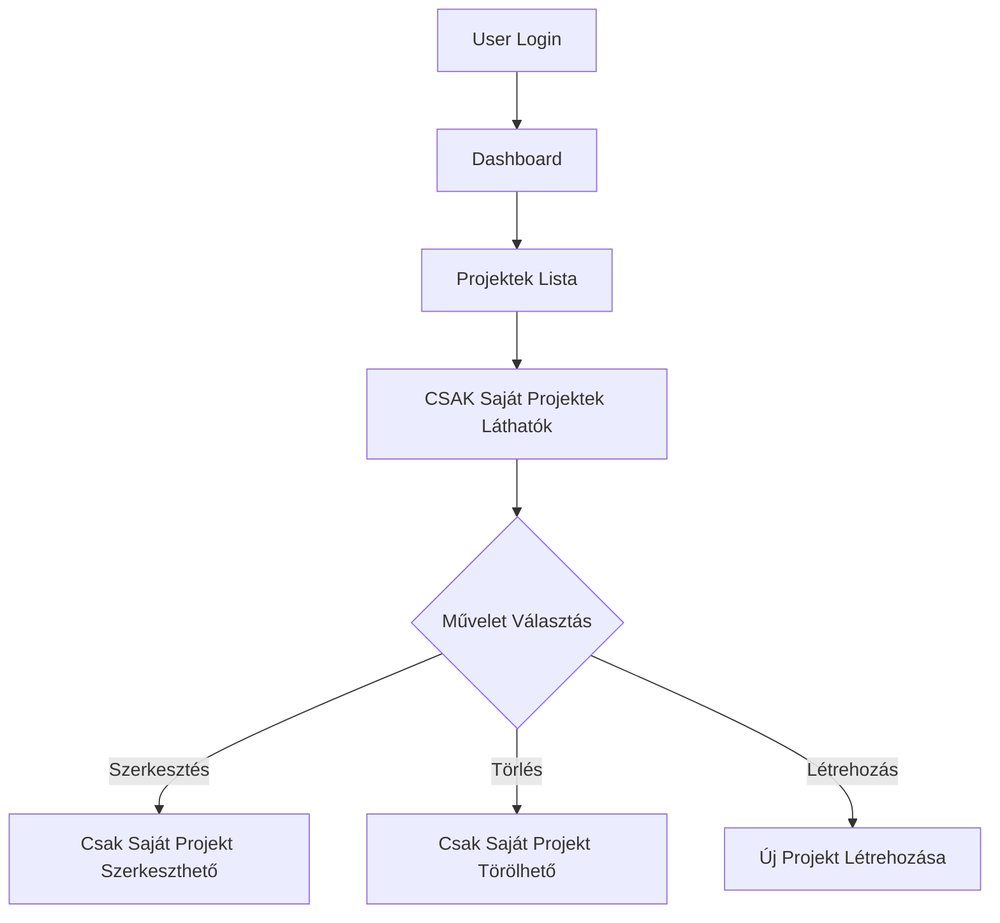

### Viewer Flow
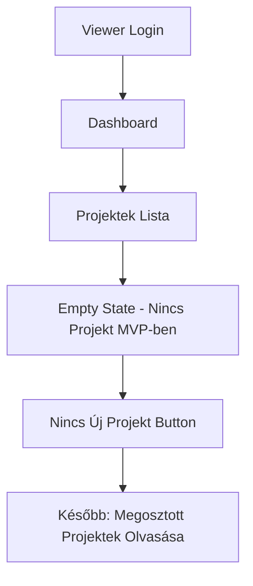

---

## 🚪 8. Logout Flow

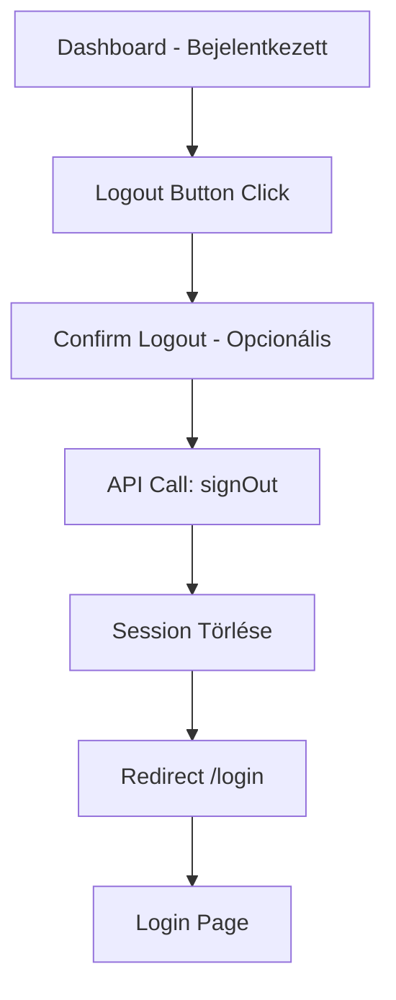

---

## 🔒 9. Protected Route Flow

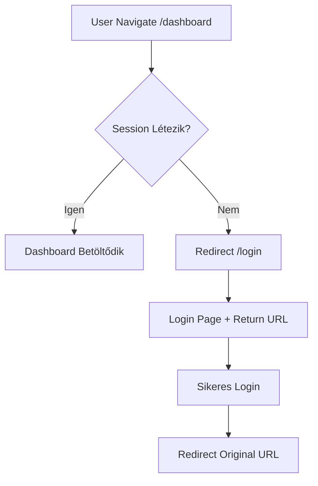

---

## ⚠️ 10. Error Handling Flow

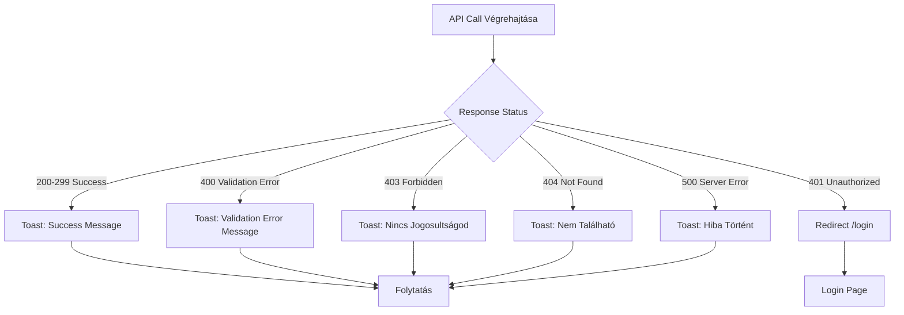

---

## 📝 Flow Megjegyzések

### Optimistic Updates
- Projekt szerkesztésnél instant UI update, majd API call
- Ha API error → revert to original state + toast

### Loading States
- Minden async művelet során loading spinner
- Button disabled loading alatt
- Skeleton screen hosszabb betöltéseknél

### Toast Notifications
- Success: Zöld
- Error: Piros
- Auto-dismiss: 3-5 másodperc

### Session Management
- Session automatikusan refresh-elődik
- Expired session → redirect login
- Protected routes middleware check

---

**Jóváhagyva:** ❌ (Pending review)
**Státusz:** Tervezési fázis